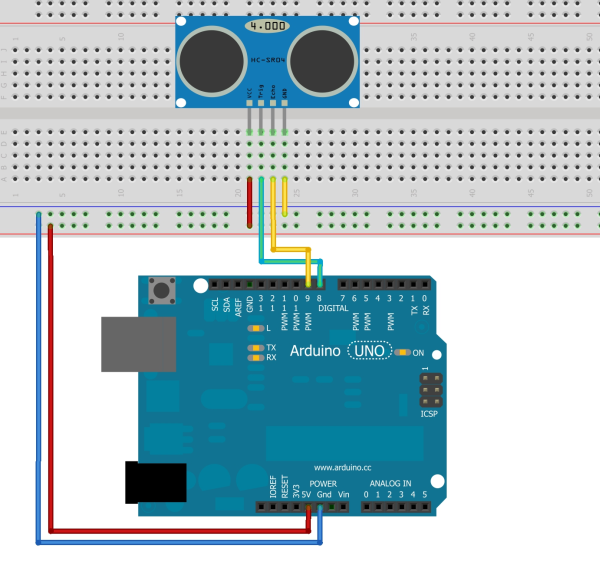

# Ultrasonic sensor

From this charpter we step intp the sensors world,for the first time Let's see something insteresting.
In this charpter,you will learn how to include a library and call its functions.

## Inlude a library

I think uv seen the libraby directory in the tutorial, download and put it into your arduino libraries.

- Click `<kbd>`Sketch`</kbd>` - `<kbd>`include Library`</kbd>` - `<kbd>`Add .ZIP Library...`</kbd>` ,and then choose your idea library.
  ---



# Example

```C++
#include "Sonar_lib.h"

int distanceOfSonar1;
Sonar sonar1;

void setup() {
  sonar1.setSonarPin(8, 9);                   //trigPin,echoPin
  Serial.begin(9600);
}

void loop() {
  distanceOfSonar1 = sonar1.sonarStart();
  Serial.print("Distance1: ");
  Serial.println(distanceOfSonar1);
}
```

Here is a piece of code,so i think you can now linking the sonar to arduino by the description of the piece of code.

OK,it's easy,now let's combine what you have learned before,to make the led lighter when the ultrasonic detector detects the obstacle ahead and the distance is getting closer and closer.

->LAST [06.Communication,get your Arduino a friend!](/06.Communication,get%20your%20Arduino%20a%20friend!.md)
->NEXT [08.Motor Control!A great step to a small goal!](/08.Motor%20Control!A%20great%20step%20to%20a%20small%20goal!.md)
