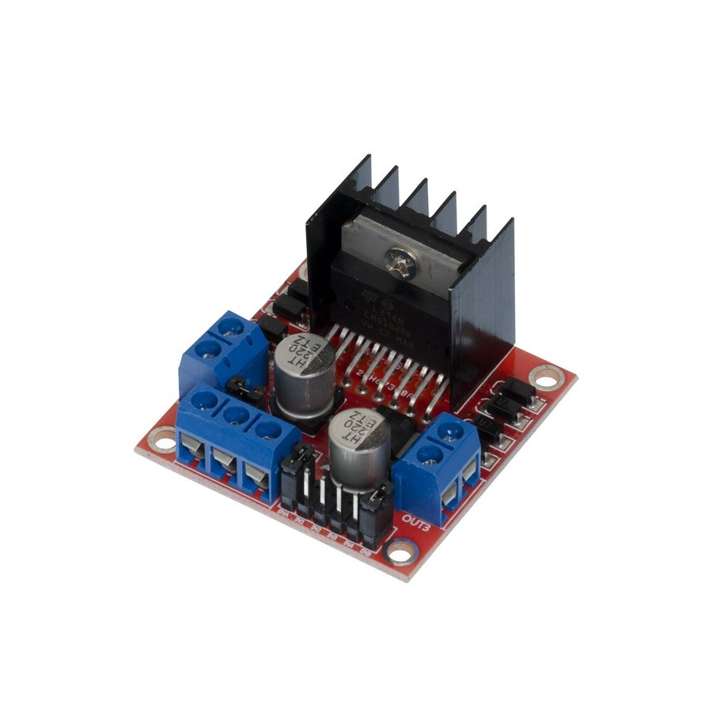
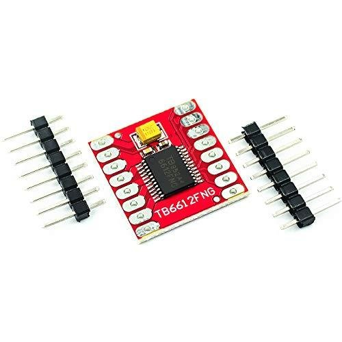
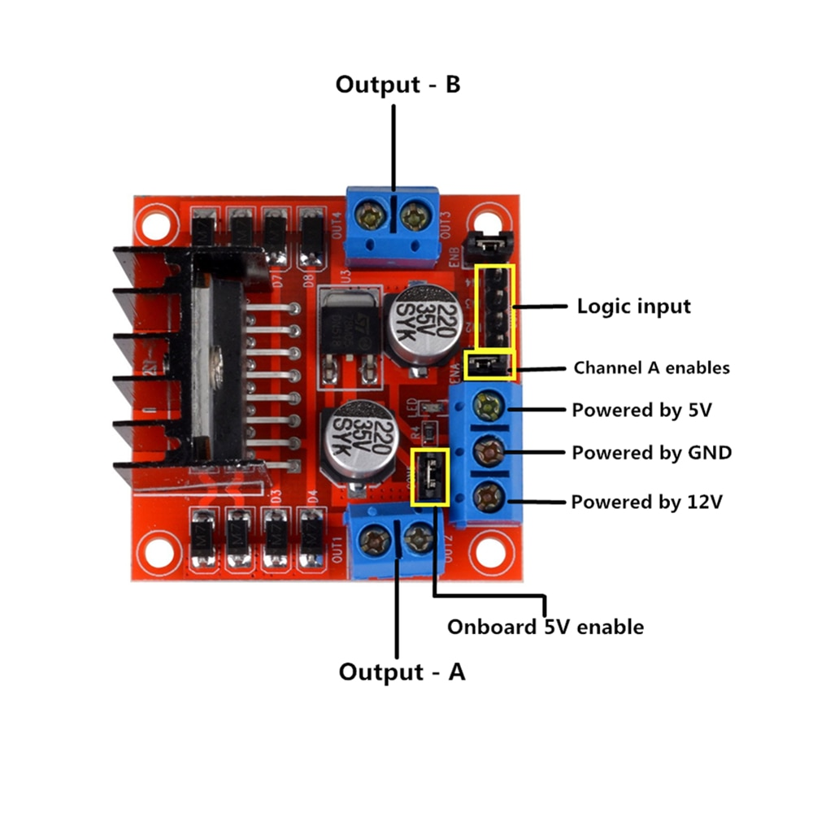

# Motor Control
Typically , we only control **DC motor** in our projects, sometimes we may use **stepper motor**.

Thus, in this chapter, we will learn how to control DC motor only.
# 1. Most Used Motor Drivers
## 1.1 Purpose:
Actually , we use motor drivers for three reasons:
- **Supply power to motors**
- **Control motor direction**
- **Control motor speed**
## 1.2 Motor drivers:

|L298N|TB6612|
|----|----|
|||

Due to MCU IOs are limited , thus we need motor drivers to finish these jobs.

There are two widely used motor drivers which are L298N and TB6612.

Though they are different motor drivers , their general purpose is the same.

So , we will only take L298N as an example , you can look up for yourself for other motor drivers.

# 2. L298N
## 2.1 Pinout:


## 2.2 **Power Pin**

|Power Pin|Function|
|----|----|
|12V|Supply power for Motors|
|GND|GND Power Supply|
|5V|5V Output Or Input|

## 2.3 **Control Pin**

|Control Pin|Function|
|----|----|
|Logical|Control motor direction|
|PWM Pin|Contorl Motor Speed|
|Output Pin|Drive Motor|

 **logical table for Control Pin**

|PinA|PinB|Output|
|:----:|:----:|:----:|
|0|0|Disable|
|0|1|clockwise|
|1|0|anti-clockwise|
|1|1|Enable|


## 2.4 **Onboard 5V Enable**

|Status|Function|
|----|----|
|Cap on|Output 5V|
|Cap off|Input 5V|

# 3. Wiring diagram


# 4. Example Code
```cpp
const uint8_t Left_A = 6;
const uint8_t Left_B = 7;
const uint8_t LeftSpeed = 5;

const uint8_t Right_A =  4;
const uint8_t Right_B = 9;
const uint8_t RightSpeed = 10;

uint8_t command;

void Stop() {
  digitalWrite(Left_A, LOW);
  digitalWrite(Left_B, LOW);
  digitalWrite(Right_A, LOW);
  digitalWrite(Right_B, LOW);
}

void Forword() {
  digitalWrite(Left_A, HIGH);
  digitalWrite(Left_B, LOW);
  digitalWrite(Right_A, HIGH);
  digitalWrite(Right_B, LOW);
}

void Backword() {
  digitalWrite(Left_A, LOW);
  digitalWrite(Left_B, HIGH);
  digitalWrite(Right_A, LOW);
  digitalWrite(Right_B, HIGH);
}

void Left() {
  digitalWrite(Left_A, HIGH);
  digitalWrite(Left_B, LOW);
  digitalWrite(Right_A, LOW);
  digitalWrite(Right_B, HIGH);
}

void Right() {
  digitalWrite(Left_A, LOW);
  digitalWrite(Left_B, HIGH);
  digitalWrite(Right_A, HIGH);
  digitalWrite(Right_B, LOW);
}

void setup() {
  pinMode(Left_A, OUTPUT);
  pinMode(Left_B, OUTPUT);
  pinMode(Right_A, OUTPUT);
  pinMode(Right_B, OUTPUT);
  pinMode(LeftSpeed, OUTPUT);
  pinMode(RightSpeed, OUTPUT);
  analogWrite(LeftSpeed, 70);
  analogWrite(RightSpeed, 70);
  Serial.begin(9600);
}

void loop() {
  if (Serial.available() > 0) {
    command = Serial.read();
  }
  switch (command) {
    case 'S': Stop(); break;
    case 'R': Right(); break;
    case 'B': Backword(); break;
    case 'L': Left(); break;
    case 'F': Forword(); break;
  }
}
```
->LAST [07.Ultrasonic sensor,a little cool.](/07.Ultrasonic%20sensor,a%20little%20cool..md)  
->NEXT [09.It's time to show!](/09.It's%20time%20to%20show!.md)
