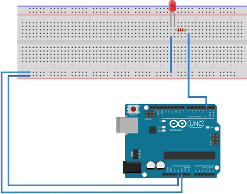

# Well,Let's getting started!

In this charpter,you will konck on the door of Arduino world for the first time.
You will install your Arduino IDE and firstly light your own LED.

## 1.Install Arduino IDE.

If you are in Windows,just click [here](https://downloads.arduino.cc/arduino-nightly-windows.zip).

For macOS, you can use `brew` commond in terminal:

```bash
brew install --cask arduino
```

And for Linux, you can use `snap` commond in terminal:

```bash
sudo snap install arduino
```

Is it easy?Using Linux right now!

Getting a word in edgewise,someone need software for Mac OS?

Alright? Move on!

OHHHHH,wait,before you start uphanding(self-create word),do you need drivers?  
If so,download and install it!

For 

- Windows : Click [Here](tools/CH34x_Install_Windows_v3_4.EXE)(CH34x_Install_Windows_v3_4.EXE)
- Linux/macOS : Congratuation! it's Superfluous!

## 2.Lighting your first LED!  

   

Attach the positive electrode of led to pin 2 like picture above and type the code below in your Arduino IED.

By the way,do you konw why a resistance is added?

Reminiscent of high school knowledge,adding a resistance can reduce current and voltage.

Normal LED just need 2V votage and about 35mA current,so a 100Ω or above resistance is necessary.

```cpp
int ledPin = 2;

void setup(){
    pinMode(ledPin, OUTPUT);
}

void loop(){
    digitalWrite(ledPin, HIGH);
    delay(1000);
    digitalWrite(ledPin, LOW);
    delay(1000);
}
```
  
From the code above,we can learn 3 functions.
## 1.pinMode(pin, mode)  
### Parameters
------
|Parameter|Instruction|
|:----:|:-----|
|pin|the Arduino pin number to set the mode of.  |
|mode|INPUT, OUTPUT, or INPUT_PULLUP|  

### Returns
------------------
Nothing   

## 2.digitalWrite(pin, value)  
### Parameters
------
|Parameter|Instruction|
|:----:|:-----|
|pin|the Arduino pin number|
|value|HIGH or LOW.|  

### Returns
------------------
Nothing   

## 3.delay(ms)
### Parameters
------
|Parameter|Instruction|
|:----:|:-----|
|ms|the number of milliseconds to pause. Allowed data types: unsigned long.|

### Returns
------------------
Nothing   


# Summarize
pinMode(pin, mode);  
digitalWrite(pin, value);  
delay(ms);
  
-----------------
# Tasks

OK,I think it's easy and you all done.
So,you can put it into practice.
Imaging that you are on a desert island，you will send out the SOS signal with led，now do it！

| letter |      Morse code      |
| :----: | :------------------: |
|   S   |  ▄&nbsp;▄&nbsp;▄  |
|   O   | ▄▄▄ ▄▄▄ ▄▄▄ |
