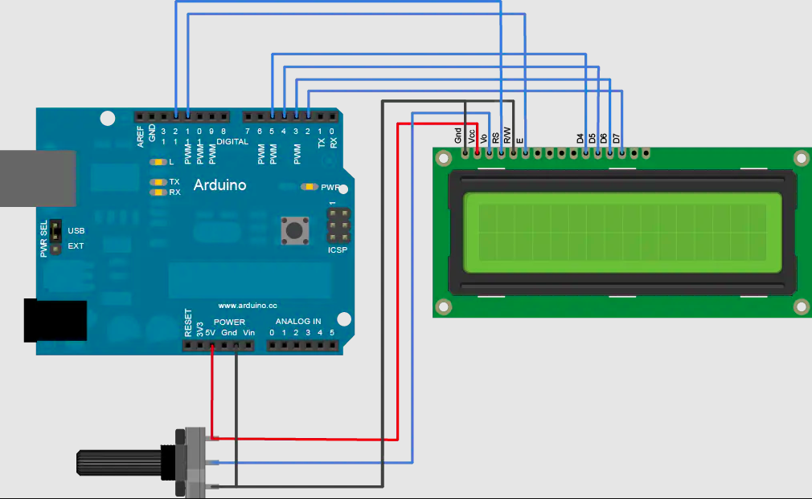

# Show Time!
## Why to show?
-----------------
I think it's a good question.while you done a component,you need it to work undependently,without connecting with your computer,so,how can we know the info in the condition of NO SERIAL MONITOR?  
YEH!YOU GOT IT!  
<br>
<div class="text" style=" text-align:center;"><b>OLED/LCD</b></div>  
<br>

## How to show
  Connetting LCD,Arduino like this.  

  

<br>  

|NO|SIGN|pin instruction|NO|SIGN|pin instruction|
|:----:|:----:|:-----|:----:|:----:|:-----|
|1|VSS|GND|9|D2|Data I/O|
|2|VDD|Positive|10|D3|Data I/O|
|3|VL|Bias signal|11|D4|Data I/O|
|4|RS|H/L|12|D5|Data I/O|
|5|R/W|H/L|13|D6|Data I/O|
|6|E|enable|14|D7|Data I/O|
|7|D0|Data I/O|15|BLA|back ground +|
|8|D1|Data I/O|16|BLK|back ground -|
    
    
```C++
#include <LiquidCrystal.h>

LiquidCrystal lcd(12, 11, 5, 4, 3, 2);                  // initialize the library with the numbers of the interface pins

void setup() {
  lcd.begin(16, 2);                                     // set up the LCD's number of columns and rows
  lcd.print("hello, world!");                           // Print a message to the LCD
}

void loop() {
  lcd.setCursor(0, 1);                                  // set the cursor to column 0, line 1(note: line 1 is the second row, since counting begins with 0)
  lcd.print(millis()/1000);                             // print the number of seconds since reset
}
```